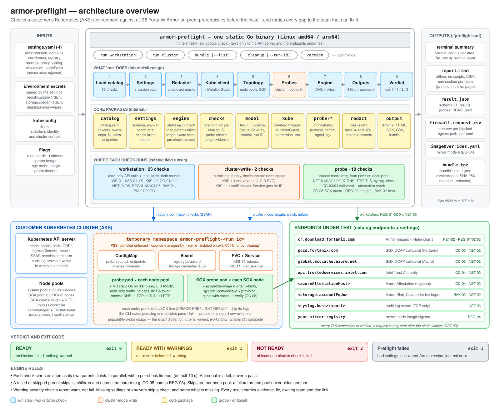
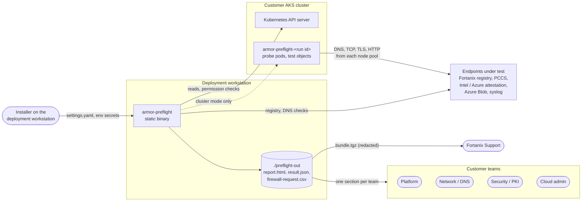
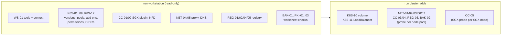
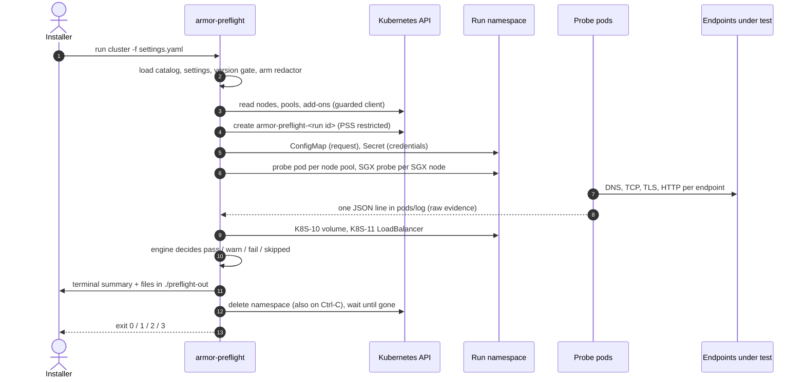
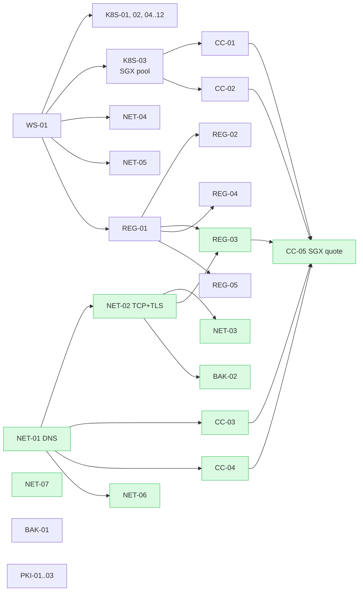
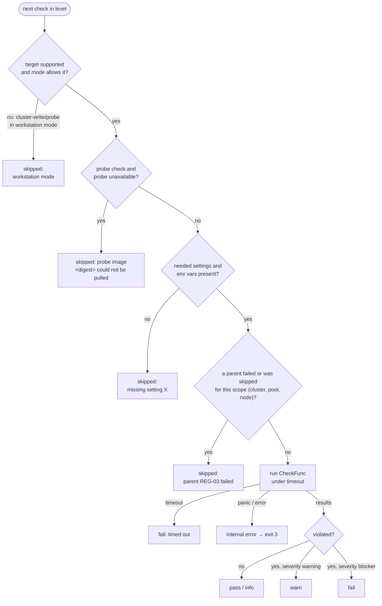
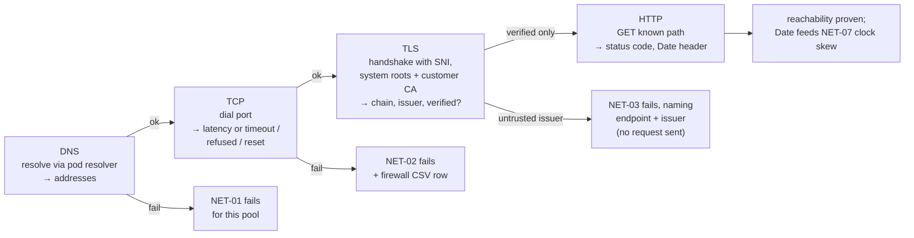
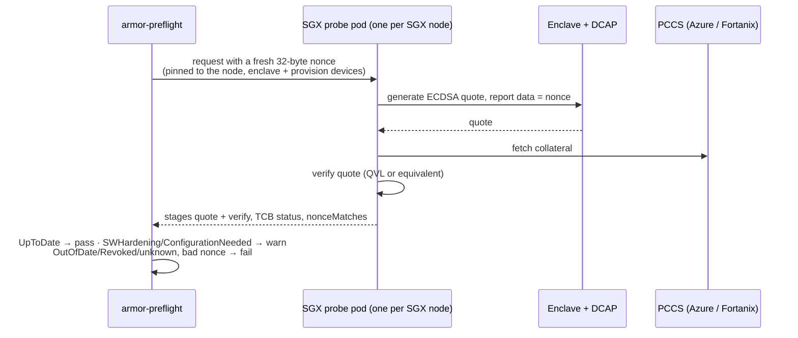
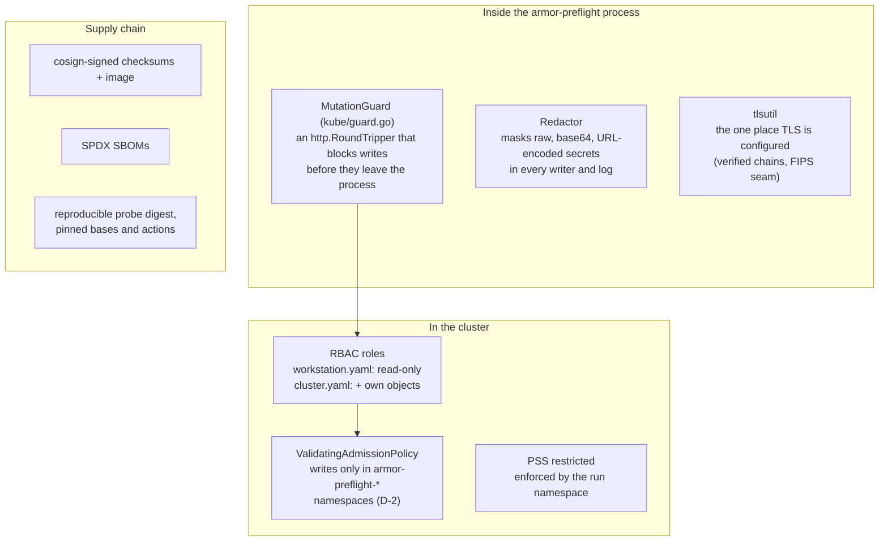

# armor-preflight architecture

This document explains how `armor-preflight` is built and why it is built that way. It follows the Phase 1 build
brief. Its requirements **R1.1–R1.6** are the product requirements, and decisions **D-1…D-20** are the calls the
[plan](../PLAN.md) made where the brief was open. The same IDs appear in the source code, so you can go from a
paragraph here to the code that implements it.

If you only want to run the tool, start with the [README](../README.md). If you want to change it, read on.

- [1. What problem it solves](#1-what-problem-it-solves)
- [2. Architecture at a glance](#2-architecture-at-a-glance)
- [3. Key concepts in plain words](#3-key-concepts-in-plain-words)
- [4. System context](#4-system-context)
- [5. Two modes](#5-two-modes)
- [6. What a run does, step by step](#6-what-a-run-does-step-by-step)
- [7. The check catalog](#7-the-check-catalog)
- [8. The engine: order, skips and the verdict](#8-the-engine-order-skips-and-the-verdict)
- [9. Probes: testing from where Armor will run](#9-probes-testing-from-where-armor-will-run)
- [10. CC-05: the SGX quote check](#10-cc-05-the-sgx-quote-check)
- [11. Outputs: routing every finding to a team](#11-outputs-routing-every-finding-to-a-team)
- [12. Security model](#12-security-model)
- [13. Package map](#13-package-map)
- [14. Testing and CI](#14-testing-and-ci)
- [15. Extending armor-preflight](#15-extending-armor-preflight)
- [16. Requirements traceability](#16-requirements-traceability)

---

## 1. What problem it solves

A Fortanix Armor on-prem install depends on dozens of prerequisites owned by different customer teams:
- Kubernetes versions and node sizes;
- SGX hardware and its device plugin;
- firewall paths to Fortanix, Intel and Azure;
- registry credentials;
- backup storage;
- certificates.

When one is missing, the install fails partway through, and it often takes a support call to work out which team has
to fix what.

`armor-preflight` checks **every published prerequisite before anyone starts the install**. It runs the checks from
where Armor will actually run (each node pool), and tells each team exactly what to fix.

The build brief's six requirements shape the whole design:

| Req | Requirement | How the design meets it |
|---|---|---|
| **R1.1** | Detect every published prerequisite gap | 35 checks defined as data in one catalog, each with severity, owner, fix and doc link. Checks run in dependency order, a failed parent skips its children by name, and an uncovered Armor version is refused |
| **R1.2** | Test network and attestation from where Armor traffic starts | Probe pods on every node pool test each endpoint in separate DNS, TCP, TLS and HTTP stages. An SGX probe on every SGX node generates and verifies a quote |
| **R1.3** | Route every finding to the team that can fix it | Terminal summary, an offline HTML report with one section per team, `result.json`, and a firewall-request CSV |
| **R1.4** | Customer security teams can approve it without an exception | Workstation mode makes zero writes (enforced in-process and proven by an audit log), cluster mode writes only inside its own namespace, probes run under PSS restricted, secrets are masked, releases are signed |
| **R1.5** | Obtainable without Fortanix registry access | Static Linux binaries. The probe image is public and also ships as an archive for customer mirrors. If the probe can't be pulled, the tool names the digest to mirror and the workstation checks still finish |
| **R1.6** | Support can trust the evidence before booking an install | `bundle` makes a redacted, checksummed archive with versions and run metadata, and shows its contents before writing |

## 2. Architecture at a glance

Read it top to bottom:

1. **Inputs** (left): a settings file with the decisions only the customer can make, secrets from environment
   variables, the kubeconfig, and flags.
2. **The binary** (centre) loads the embedded catalog, checks the settings, arms the secret redactor, connects to the
   cluster through a write-blocking guard, maps the node pools, starts probes (cluster mode), runs the engine, and
   writes the outputs.
3. **Where checks run**: 23 checks are read-only from the workstation. 2 create test objects (cluster mode). 10 run
   inside probe pods (cluster mode).
4. **The customer's cluster** (bottom left): everything Preflight creates lives in one temporary, labelled namespace
   that is deleted at the end.
5. **Endpoints under test** (bottom right): the only hosts Preflight contacts besides the Kubernetes API server.
6. **Verdict** (bottom): READY, READY WITH WARNINGS, NOT READY, or "Preflight failed", each with its own exit code.

## 3. Key concepts in plain words

| Term | Meaning |
|---|---|
| **Fortanix Armor** | The product being installed. It runs on Kubernetes (AKS) and uses Intel SGX enclaves. |
| **Intel SGX** | A CPU feature that runs code in an *enclave*, memory the host can't read. Armor needs SGX-capable nodes (Azure DCsv3). |
| **Quote / DCAP / PCCS** | An SGX enclave proves what it is by producing a signed *quote*. DCAP is Intel's attestation stack. The PCCS serves the certificates and revocation data (*collateral*) needed to verify quotes. |
| **Node pool** | A group of identical nodes. Armor uses a *system* pool and an *SGX* pool. Firewall rules often differ per pool, which is why Preflight tests from each one. |
| **Check** | One prerequisite with a stable ID (e.g. `NET-02`), a severity (`blocker`, `warning`, `info`), an owning team, a fix and a doc link. |
| **Catalog** | [`internal/catalog/catalog.yaml`](../internal/catalog/catalog.yaml), the single source of truth for all 35 checks, their thresholds and the endpoints. It is embedded in the binary. |
| **Probe** | A tiny, locked-down pod that Preflight starts on a node pool to test things from that pool's point of view. |
| **Workstation mode / cluster mode** | `run workstation` only reads. `run cluster` also starts probes and creates test objects in its own temporary namespace. |
| **Verdict** | The overall result: READY, READY WITH WARNINGS, or NOT READY. |

## 4. System context

Nothing is sent anywhere automatically. There is no telemetry, no update check and no licence call. Results stay in
the output directory until the customer chooses to share the bundle.

## 5. Two modes

| | `run workstation` | `run cluster` |
|---|---|---|
| Checks that run | 23 (`runsIn: workstation`) | all 35 |
| Cluster writes | **none**. Only reads, plus SelfSubjectAccessReviews that the API server doesn't store (D-1) | only inside `armor-preflight-<run id>`, which it creates and deletes |
| Needs | [`deploy/rbac/workstation.yaml`](../deploy/rbac/workstation.yaml) | also [`deploy/rbac/cluster.yaml`](../deploy/rbac/cluster.yaml) + its ValidatingAdmissionPolicy (D-2) |
| Checks skipped | K8S-10/11 and the 10 probe checks, with the reason "workstation mode" | none, except those missing settings or an image |
| Good for | a first look, or sites that can't allow any writes yet | the full answer before booking an install |

## 6. What a run does, step by step

[`internal/cli/run.go`](../internal/cli/run.go) drives every run in this order:

1. **Load the catalog.** It parses and validates the embedded `catalog.yaml`: IDs are unique, dependencies exist and
   are acyclic, and no required field is empty.
2. **Load settings and check the version.** It rejects inline secrets. If `armorVersion` isn't covered by this build's
   catalog, the run stops with exit 3 and names the Preflight release to use.
3. **Arm the redactor.** It registers every secret the settings name, including base64, URL-encoded and docker-auth
   forms. From here on, everything printed or written goes through it.
4. **Connect to Kubernetes through the MutationGuard.** The mode decides which writes the guard allows: none, or only
   the run namespace.
5. **Discover the topology.** It groups nodes into pools, records node IPs and finds the SGX nodes.
6. **Cluster mode only: run the probes.** It creates the namespace, ConfigMap and Secret, starts one probe per pool and
   one SGX probe per SGX node, and collects their JSON output. Cleanup is deferred and also runs on Ctrl-C.
7. **Run the engine.** Checks run in dependency levels, in parallel, each under a timeout.
8. **Write the outputs.** It writes `result.json`, `report.html`, `firewall-request.csv` and any artifacts such as
   `imageOverrides.yaml`, then prints the terminal summary.
9. **Exit with the verdict's code.** If an internal error occurred, or this build lacks a check, it exits 3 instead of
   giving a verdict that can't be trusted.

## 7. The check catalog

The catalog holds **everything about a check except its logic**:
- ID, title and area;
- severity (and a lower severity for non-production, for the BAK checks);
- owning team;
- where it runs (`runsIn`) and what each result covers (`scope`);
- the settings it needs;
- dependencies, remediation text, doc link and thresholds.

The endpoint list lives here too. The code registers one function per catalog ID. A test fails the build if the
registered IDs and the catalog IDs ever differ.

| Area | Checks | Runs in | Main owner |
|---|---|---|---|
| Workstation | WS-01 tools present and KUBECONFIG targets the intended cluster | workstation | Platform |
| Kubernetes | K8S-01 version ≥ 1.34.8 · K8S-02 system pool ≥ 3 × D4d_v5 · K8S-03 SGX pool ≥ 3 × DC8_v3 · K8S-04 Ubuntu 24 (warn) · K8S-05 no K8ssandra · K8S-06 no existing Armor operator · K8S-07 ingress · K8S-08 cert-manager + ClusterIssuer · K8S-09 installer permissions · K8S-12 CIDRs (info) | workstation | Platform |
| | K8S-10 a volume provisions · K8S-11 a LoadBalancer gets an address (warn) | cluster-write | Platform / cloud admin, Network |
| Confidential computing | CC-01 SGX device plugin per node · CC-02 NFD labels SGX nodes | workstation | Platform |
| | CC-03 DCAP collateral reachable · CC-04 attestation services reachable · CC-05 each SGX node makes a quote that verifies | probe | Network, Platform + Fortanix |
| Network | NET-01 DNS · NET-02 TCP 443 + TLS · NET-03 no TLS interception · NET-06 syslog (warn) · NET-07 clock skew (warn) | probe | Network / DNS / security |
| | NET-04 proxy consistency (warn) · NET-05 Armor domains resolve (warn) | workstation | Platform, Network / DNS |
| Registry | REG-01 credentials valid · REG-02 chart pullable · REG-04 mirror has every digest · REG-05 pull secrets (warn) | workstation | Fortanix Support + platform |
| | REG-03 every release image resolves from each pool | probe | Network + platform |
| Backup | BAK-01 storage account kind and replication | workstation | Cloud admin |
| | BAK-02 credentials can write, read and delete a test blob | probe | Cloud admin |
| PKI | PKI-01 Armor domain decided · PKI-02 CA ready with chain · PKI-03 API SANs include `api.<domain>` | workstation | Security / PKI |

### How checks depend on each other

This graph comes straight from the catalog's `dependsOn` fields. If a parent fails or is skipped, every child reports
**skipped** and names the parent.

Green nodes run in probes. `NET-07`, `BAK-01` and `PKI-01..03` have no parents.

### Values that aren't known yet

Some values must come from Fortanix, such as the supported cert-manager versions and the chart reference. The catalog
marks these `TBD`. Checks that need a TBD value report **skipped** and name the missing value; they never guess
(D-9). Thresholds such as minimum node counts, SKUs, clock skew and pull-secret expiry are catalog parameters, not
code.

## 8. The engine: order, skips and the verdict

[`internal/engine`](../internal/engine/engine.go) sorts the catalog into dependency **levels**. It runs each level's
checks in parallel. Each check gets the per-check timeout (`-t`, default 10 s), or the catalog's longer
`timeoutSeconds` for checks that wait on the cluster, such as K8S-10 and K8S-11.

Key rules:
- **Scope-aware skips.** A NET-01 failure on `sgxpool1` skips NET-02 only on `sgxpool1`. Other pools still get their
  own results.
- **Never pass silently.** A timeout is a fail. Node sizes are judged on the CPU and memory the nodes actually report.
  A non-AKS cluster gives an "unsupported profile" warning (D-8).
- **Settings-dependent severity.** BAK-01 and BAK-02 are blockers when `storage.environment: production` and warnings
  for `poc`. REG-04 only applies in mirror mode.
- **Complete results.** Every result carries evidence, remediation, the owning team and a doc link. A test fails if
  any is empty.

**Verdict** ([`internal/model/verdict.go`](../internal/model/verdict.go)):

| Verdict | Rule | Exit |
|---|---|---|
| READY | no blocker failed and nothing warned | `0` |
| READY WITH WARNINGS | no blocker failed, at least one warn | `1` |
| NOT READY | at least one blocker failed | `2` |
| Preflight failed | bad settings, uncovered Armor version, internal error, unimplemented check | `3` |

## 9. Probes: testing from where Armor will run

A firewall may allow the workstation to reach the Fortanix registry and still block the SGX pool. That is why the
network, registry and backup checks run **inside pods on each node pool** ([`internal/probe`](../internal/probe)).

**Orchestration** ([`probe/orchestrator`](../internal/probe/orchestrator/orchestrator.go)):

- **Run namespace.** `armor-preflight-<run id>` (run ID `YYYYMMDD-HHMM-<4 hex>`). It enforces the `restricted`
  Pod Security Standard and carries the `app.kubernetes.io/managed-by=armor-preflight` and `armor-preflight/run-id`
  labels.
- **Probe pods.** One bare Pod per node pool, pinned by node selector and tolerating the pool's taints. Each SGX node
  also gets one SGX probe pod.
- **Inputs.** The request (endpoints, images, timeouts) goes in a ConfigMap. The registry password and storage
  credential go in a Secret in the same namespace, deleted with it (D-3).
- **Pull failures.** If a pod reports `ErrImagePull` or `ImagePullBackOff`, the CLI records the exact image and marks
  the probe checks skipped with that reason. The workstation checks still finish (R1.5).
- **Cleanup.** The namespace is deleted with foreground propagation, and the CLI waits until it's gone, after a normal
  exit or Ctrl-C. `armor-preflight cleanup` removes leftovers by label after a kill, including PVs retained from K8S-10.

**The probe itself** is a static Go binary (about 2 MB) on distroless. It:
- runs as UID 65532 with a read-only root filesystem;
- drops all capabilities, uses RuntimeDefault seccomp and has no service-account token;
- runs within 200m CPU and 64 MiB of memory.

It needs no Kubernetes API access. It tests, prints **one JSON line** prefixed `ARMOR-PREFLIGHT-RESULT` and exits.
Probes only report **raw observations**; the CLI applies the catalog thresholds and decides pass or fail. That keeps
every rule in one place.

### Staged network tests (`nettest`)

Every endpoint goes through four stages, each recorded as its own evidence entry. A blocked firewall path, a missing DNS
record and a TLS-inspecting proxy each show up as exactly that, for the node pool concerned.

- Any HTTP response over verified TLS proves reachability (D-6). For example, the registry answers `GET /v2/` with 401.
- NET-03 compares the presented chain with the expected issuers. If the settings give `proxy.trustedCaPath` and that CA
  signed the chain, it passes and records "interception present but trusted".
- NET-07 compares the probe clock with the `Date` headers from endpoints already under test, not NTP. That keeps
  traffic to the endpoints under test only (D-14).
- If the settings set an HTTPS proxy, probes tunnel through it with CONNECT, and the evidence says "via proxy".

## 10. CC-05: the SGX quote check

A quote can only be generated from inside an enclave with Intel's DCAP libraries, which a static distroless binary
can't do. So CC-05 uses a **separate SGX probe image** passed with `--sgx-probe-image`, built with the enclave
toolchain Fortanix chooses (D-5). The contract that image must meet is in [sgx-probe.md](sgx-probe.md).

CC-05 depends on CC-01 to CC-04 and REG-03. Without `--sgx-probe-image` it reports **skipped** with the reason "no SGX
probe image is configured".

## 11. Outputs: routing every finding to a team

| Output | Audience | What's in it |
|---|---|---|
| Terminal summary | the installer | verdict first, counts per area, each failure with its owning team and fix, and what wasn't checked and why |
| `report.html` | every customer team | self-contained and offline (no scripts, no external loads, strict CSP): verdict and severity counts, **one section per owning team** that prints on its own page, all results, the probes that ran and the permissions used |
| `result.json` | automation, Support | [schema v1](../schema/result.v1.json): tool/catalog versions, target, run info, results with evidence, probes, RBAC. Fields may be added within v1; removing or renaming bumps `schemaVersion` |
| `firewall-request.csv` | network team | one row per failed egress path, with the columns `source_subnet,destination,port,protocol,direction,purpose,check_id`. The source is `nodePools.<pool>.subnet`, or node IPs as /32 (D-16) |
| `imageOverrides.yaml` | platform team | mirror mode only (REG-04): release images and their mirror copies |
| `bundle.tgz` | Fortanix Support | `result.json`, `versions.json` and a SHA-256 manifest. Redacted. `--list` shows the contents first, and the command asks before writing |

## 12. Security model

The goal (R1.4) is that a customer security team can approve Preflight **without an exception**. The one-page
summary is [SECURITY-BRIEF.md](../SECURITY-BRIEF.md), and the full review is [SECURITY-REVIEW.md](../SECURITY-REVIEW.md).

| Concern | Control | Proven by |
|---|---|---|
| Workstation mode must not write | The MutationGuard blocks every POST, PUT, PATCH and DELETE except SelfSubjectAccessReview and SelfSubjectRulesReview, which aren't stored (D-1). The shipped role is read-only | `audit-lab`: a real kube-apiserver's audit log, with the tool running as an identity bound only to the role |
| Cluster mode writes only its own objects | The guard allows only the run namespace. The ClusterRole plus admission policy reject writes elsewhere | `audit-lab`, `TestPublishedRolesGrantOnlyExpectedWrites` |
| Nothing left behind | Everything is labelled, the namespace is deleted on exit and on Ctrl-C, and `cleanup` removes leftovers after a kill | `audit-lab` covers all three cases |
| Probe privileges | PSS restricted, non-root, read-only rootfs, no capabilities, no service-account token, no host access | `TestProbePodIsRestricted` and admission in `audit-lab` |
| Secrets | Never in the settings file (it names env vars). Masked in every output, including encoded forms and URL credentials | `TestSeededSecretsNeverAppear` plants canaries and greps every output, on every build |
| Unexpected network traffic | Only the API server and the endpoints under test are contacted. No telemetry | `TestWorkstationEgressIsOnlyTheEndpointsUnderTest` |
| TLS interception | Every connection is verified, and no request is sent over an unverified one | NET-03 tests with an intercepting proxy fixture |
| Tampered release | Signed `checksums.txt`, a signed probe image, SBOMs and `scripts/verify-release.sh` | CI job `release-snapshot` verifies a signed build and shows a tampered file fails |

Known limits: probe results come from the customer's nodes, so a compromised node could lie. Cluster admins can read
the probe Secret while a cluster-mode run lasts.

## 13. Package map

| Path | Responsibility |
|---|---|
| `cmd/armor-preflight` | CLI entry point; version info set at build time |
| `cmd/probe` | probe binary (separate image) |
| `internal/cli` | `run workstation\|cluster`, `bundle`, `cleanup`, `version`; the run flow in `run.go` |
| `internal/catalog` | embedded `catalog.yaml`, validation, version coverage, endpoint resolution |
| `internal/settings` | settings schema, validation, env-var secret references |
| `internal/engine` | dependency levels, parallel execution, skip rules, timeouts, report |
| `internal/checks` | one file per area (`workstation`, `kubernetes`, `cc`, `cc05`, `network`, `registry`, `backup`, `pki`, `clusterwrite`, `probe`), plus topology discovery |
| `internal/model` | Result, Evidence, Status, Severity, Scope, Verdict, run ID |
| `internal/kube` | client-go wrapper, MutationGuard, the permission lists reported in outputs |
| `internal/probe/orchestrator` | namespace, ConfigMap/Secret, pods, log collection, cleanup |
| `internal/probe/protocol` | request/response JSON shared by the CLI and probes |
| `internal/probe/nettest` | staged DNS → TCP → TLS → HTTP tester |
| `internal/probe/agent` | the probe's main logic; reused unchanged by an SGX probe image |
| `internal/probe/sgx` | `Quoter` / `Verifier` interfaces and fakes |
| `internal/registry`, `internal/azblob` | registry v2 client (token auth, manifest HEAD, no pulls), Azure Blob put/get/delete |
| `internal/redact` | secret registry and redacting writers |
| `internal/tlsutil` | the only place TLS configs are built |
| `internal/output` | terminal, HTML template, JSON record, CSV, bundle, file permissions |
| `internal/exitcode` | documented exit codes |
| `deploy/rbac`, `deploy/probe` | least-privilege roles and admission policy; probe Dockerfile |
| `schema/result.v1.json` | JSON Schema for `result.json` |
| `scripts/` | `audit-lab.sh`, release, signing and verification scripts |

## 14. Testing and CI

The CI workflow (`.github/workflows/armor-preflight.yml`) runs on every change under `armor-preflight/`:

| Job | What it proves |
|---|---|
| `test` | `gofmt`, `go vet`, staticcheck, shellcheck, actionlint, unit tests, static cross-builds. Tests include a violating fixture for each of the 35 checks, a compliant cluster giving READY, verdicts and exit codes, dependency skips, schema validation, offline HTML, CSV rows, redaction canaries and egress limits |
| `audit-lab` | starts a real kube-apiserver with audit logging and runs Preflight as an identity bound only to the shipped roles. Fails on any write in workstation mode, any write outside the run namespace, a failed restricted admission, or leftovers after exit, interrupt or kill + `cleanup` |
| `probe-image` | builds the probe image |
| `govulncheck` | known vulnerabilities in dependencies |
| `release-snapshot` | builds a full signed release, verifies it with `scripts/verify-release.sh`, and shows a tampered file fails |

Some criteria need real hardware, cloud services or people, such as a compliant AKS reference cluster, SGX quotes, a
10-node timing run and CSV usability. Those are manual tests listed in the [README](../README.md#manual-tests).
[ACCEPTANCE.md](../ACCEPTANCE.md) maps every criterion to its evidence.

## 15. Extending armor-preflight

| You want to… | Change |
|---|---|
| Add a check | Add an entry to `catalog.yaml` (ID, severity, owner, `runsIn`, `scope`, `dependsOn`, remediation, doc link) and register a function with the same ID in `internal/checks`. Add a violating fixture. The catalog/registry test fails until both exist |
| Change a threshold | Edit `parameters` in `catalog.yaml`; no code change |
| Add an endpoint | Add it to `endpoints` in `catalog.yaml` with its purpose, HTTP path and the checks that use it |
| Support a new Armor version | Add it to `armorVersions` in the catalog once Fortanix confirms it |
| Implement CC-05 | Build an SGX probe image that meets [sgx-probe.md](sgx-probe.md), for example by reusing `internal/probe/agent` with a real `sgx.Provider` |
| Add a host check (Phase 2) | The catalog's `target: host` field and the runner abstraction are in place for the CN-* checks |

## 16. Requirements traceability

| Requirement | Where it is implemented | Evidence |
|---|---|---|
| R1.1 detect every gap | `internal/catalog`, `internal/engine`, `internal/checks` | [ACCEPTANCE.md § R1.1](../ACCEPTANCE.md#r11-detect-every-published-prerequisite-gap) |
| R1.2 test from where traffic starts | `internal/probe/*`, `internal/checks/network.go`, `cc05.go` | [ACCEPTANCE.md § R1.2](../ACCEPTANCE.md#r12-test-network-and-attestation-from-where-armor-traffic-originates) |
| R1.3 route findings to teams | `internal/output` | [ACCEPTANCE.md § R1.3](../ACCEPTANCE.md#r13-route-every-finding-to-the-team-that-can-fix-it) |
| R1.4 approvable by security | `internal/kube/guard.go`, `deploy/rbac`, `internal/redact`, `internal/tlsutil`, release scripts | [ACCEPTANCE.md § R1.4](../ACCEPTANCE.md#r14-customer-security-teams-can-approve-preflight-without-an-exception) |
| R1.5 obtainable without registry access | `.goreleaser.yaml`, `scripts/release.sh`, pull-failure handling in `orchestrator` | [ACCEPTANCE.md § R1.5](../ACCEPTANCE.md#r15-preflight-is-obtainable-without-fortanix-registry-access) |
| R1.6 trustworthy evidence for Support | `internal/cli/bundle.go`, `internal/output/bundle.go` | [ACCEPTANCE.md § R1.6](../ACCEPTANCE.md#r16-support-can-trust-the-evidence-before-booking-an-install) |

The reasoning behind each design choice (D-1 … D-20) is in [PLAN.md §8](../PLAN.md#8-conflicts-and-open-decisions-in-the-brief).
Where each one landed in the code is in [DECISIONS.md](../DECISIONS.md).
